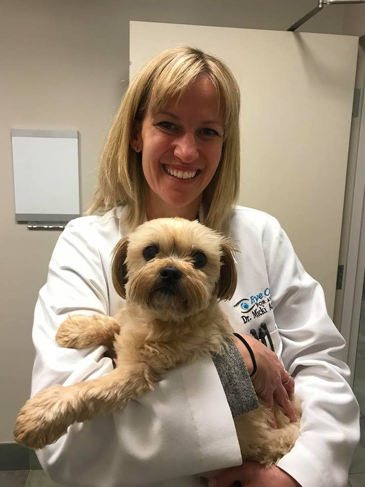

Dr. Micki Armour grew up in the Washington DC area and attended Holton-Arms School in Bethesda, Maryland.  After attending Colby College, she graduated from the University of Pennsylvania’s School Of Veterinary Medicine. She then completed an internship and a three-year residency, after which she became a board certified Diplomate of the American College of Veterinary Ophthamologists. Dr. Armour and her wonderful husband Phil have 3 sons, Brayden, Finn and Eric. She enjoys running, skiing, ice skating (go caps!) and being active with the boys.  Her first-born "children" Brody (a black lab) and Sam (a boxer) have been with her through her internship and residency, and love to hike in Great Falls park.  Dr. Armour is so excited to bring Veterinary Ophthalmology to the District of Columbia with Friendship Hospital for Animals. 

## Ophthalmology

I grew up in the Washington DC area and attended Holton-Arms School in Bethesda, Maryland. When I was growing up in the area, my own pets were patients at Friendship Hospital for Animals.  My husband Phil and I have 3 sons, Brayden, Finn and Eric. I enjoy running, skiing, ice hockey (go Caps!) and being active with the boys. My first-born "children" Brody (a black lab) and Sam (a boxer) love to hike in Great Falls park.  

## Clinical Areas of Interest
I enjoy offering the gold standard of medical and surgical care for ophthalmic diseases in our pets. In particular, I enjoy collaboration with human ophthalmologists in the field of corneal diseases, glaucoma and cataracts.

## About Armour Veterinary Ophthalmology
Armour Veterinary Ophthalmology brings excellent ophthalmic care to patients within the District of Columbia. My team focuses on exceptional quality while providing the highest standards of patient care and client communication. I offer specialty services including phacoemulsification for cataracts, endocyclophotocoagulation for glaucoma, medical management of chronic dry eye and revolutionizing corneal disease therapy. 
I am so excited to join the innovative team at Friendship Hospital for Animals.  The doctors and staff are so friendly and caring; it is wonderful to work as a collective group where general practitioners, emergency veterinarians and specialty veterinarians can all provide the best care for your pet.

## Education
After attending Colby College, I graduated from the University of Pennsylvania’s School Of Veterinary Medicine. After completing an internship at Red Bank Veterinary Hospital and a three-year residency in Tustin, California, I became a board certified Diplomate of the American College of Veterinary Ophthamologists. 

## Board Certifications
* Diplomate, American College of Veterinary Ophthalmologists
https://member.acvo.org/user_location/3024

## Publications and Research
### Journal Publications
* Evans, P., Armour, M. and Dubielzig, R. Ocular lesions following suspected lightning injury in a horse. Veterinary Ophthalmology. Volume 15, Issue 4, July 2012, Pages: 276–279
* Armour, M., Broome, M., Dell’Anna, G., Blades, N. and Esson, D. A review of orbital and intracranial magnetic resonance imaging in 79 canine and 13 feline patients (2004–2010). Veterinary Ophthalmology. Volume 14, Issue 4, July 2011, Pages: 215–226.
* Esson, D., Armour, M. Mundy, P., Schobert, C. and Dubielzig, R.. The histopathological and immunohistochemical characteristics of pigmentary and cystic glaucoma in the Golden Retriever. Veterinary Ophthalmology Volume 12, Issue 6, November/December 2009, Pages: 361–368,
* D. Dustin Dees, Kate J. Spahn, Lynsey Smith Wagner, Andrew Greller, Danielle Paglia, Micki D. Armour and Richard Madsen Effect of prophylactic topical hypotensive medications in reducing the incidence of postoperative ocular hypertension after phacoemulsification in dogs. Veterinary Ophthalmology. Volume 20, Issue 6, November 2017, Pages: 514–521
* Rosalie M. Atkins, Micki D. Armour and Jennifer A. Hyman Surgical outcome of cats treated for aqueous humor misdirection syndrome: a case series. Veterinary Ophthalmology. Volume 19, Issue S1, July 2016, Pages: 136–142

### Abstracts
* ACVO 2008 A comparison of the efficacy of CaraViscTM and Hylartin® as viscoelastic devices in small animal cataract surgery. M. Armour, D. Esson, and G. Lynch. Eye Care for Animals, Tustin, CA, USA
* ACVO 2015 The histopathological results of Trabectome
on the iridocorneal angle in enucleated goniodysgenic canine eyes. MD Armour* and LB Teixeira
* IEOC 2017 A retrospective review of periocular and ocular equine mastocytosis (Mast Cell Tumor) MD Armour,1 L Teixera,2 and K Bordeleau,3 Eye Care for Animals, Leesburg VA1, COPLOW University of Wisconsin-Madison School of Veterinary Medicine2, Private Practice Wellington FL.3

