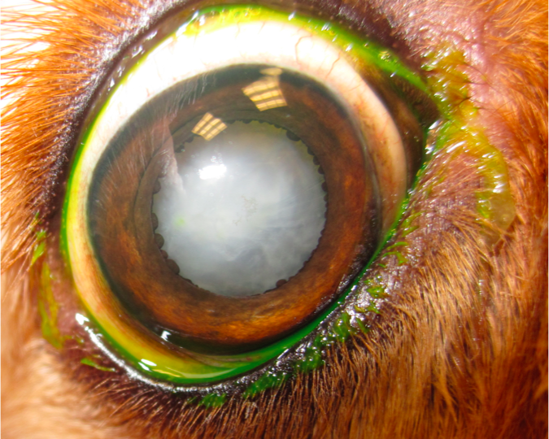

A cataract is an opacity of the lens that will often prevent light from reaching the retina.  

There are different levels of cataract formation:
* Punctate cataract - this is typically “dot” sized, and does not often result in vision loss.  
* Incipient cataract - involves less than 10% of the lens volume
* Immature cataract - involves 10-99% of the lens volume
* Mature cataract - involves all of the lens volume.  This results in vision loss.
* Hypermature cataract - a hardened lens with a “raisin-like” crystalline appearance

There are many causes of cataracts, including juvenile onset, traumatic, secondary to inflammatory processes and metabolic (especially secondary to diabetes mellitus). Sometimes, cataracts can be inherited and passed down through generations. In cases of juvenile onset or diabetic cataracts, sometimes these opacities can form very rapidly, resulting in an acute blindness.

Currently there is no medical therapy to slow the progression or remove cataracts (although there are some potential medications in development). Surgery (called phacoemulsification) is recommended as the preferred treatment option.

If your pet has been diagnosed with a cataract that would benefit from phacoemulsification, pre-cataract testing is typically recommended.  This includes 3 steps:
1. Gonioscopy - evaluation of the iridocorneal drainage angle.  Abnormalities seen here could predispose your pet to secondary glaucoma after surgery.  Often, if abnormalities are detected, a secondary procedure (endolaser) is recommended.
1. Ocular ultrasonography - this is a sonogram of the eye.  The purpose is to evaluate the sections of the eye that cannot be seen on ophthalmic examination due to the presence of the cataract.
1. Electroretinogram - this test evaluates retinal function.  After 20 minutes of dark adaptation, a bright light is directed at the eye.  The retinal electrical response will determine whether the retina is functioning at a capacity that would benefit from surgery
These steps, called “Cataract Pre-testing,” take approximately 2 hours to complete. Once your pet has undergone these 3 tests, we will be able to determine if he or she is a candidate for cataract surgery.

Early detection of a cataract is preferred and an early examination is recommended if you are concerned about cataracts in your pet. Often, it is important to start your pet on eye drops that would minimize lens-induced inflammation and decrease the risk of secondary glaucoma.  This eye drop is often given long term.

The most common complications of cataracts and cataract surgery that can lead to blindness include chronic inflammation, glaucoma, retinal detachment.  This can occur in approximately 5% of patients.  Other less common complications include secondary infection, corneal ulcer formation and opacities of the lens capsule.

