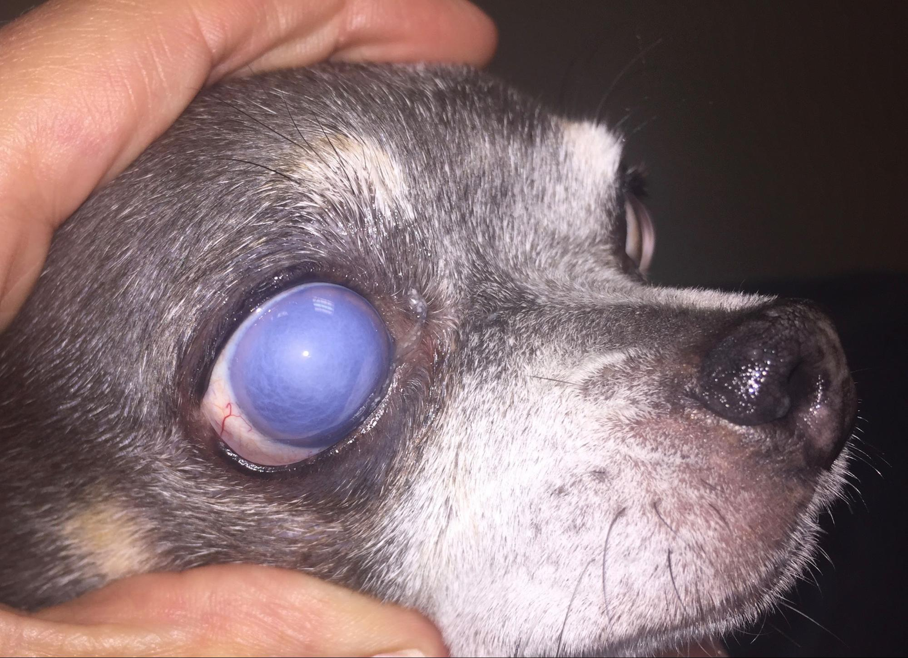
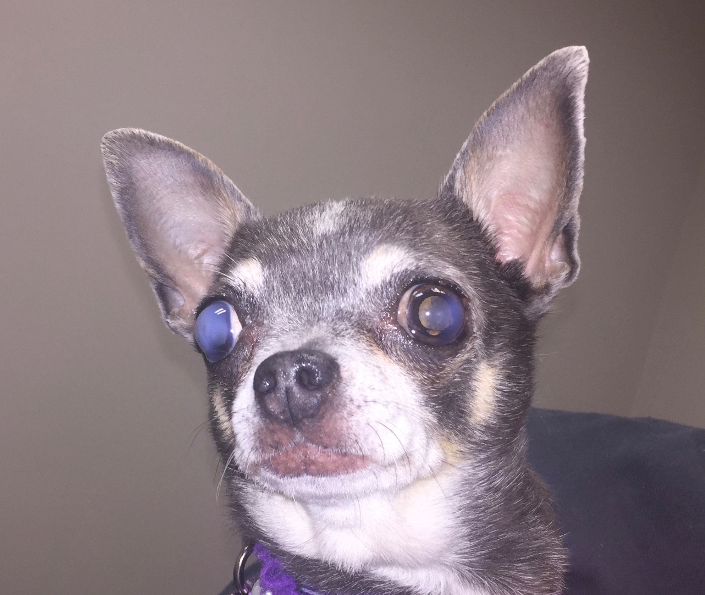

Corneal dystrophy is an opacification of the cornea where mineral and/or lipid is deposited.  Many owners will first notice a “white spot” on the eye and an absence of ocular discomfort.  Corneal dystrophy is often considered inherited within certain breeds such as the Cavalier King Charles Spaniel, Husky and Beagle; however, it can be diagnosed in any dog breed.

Corneal dystrophy is often seen in both eyes in a symmetrical appearance.  Sometimes, it can be associated with high cholesterol or triglyceride levels on bloodwork.  **Please ask your primary veterinarian to examine these values at your next wellness examination.**

Treatment for corneal dystrophy can vary.  There are some mild cases that do not require any medications.  Others can benefit from topical immunomodulatory medications or anti-inflammatories. Rarely, if the mineral deposits come to the surface of the cornea and cause irritation/corneal ulcers, a diamond bur keratotomy or keratectomy may be useful to hasten healing.  

**If your pet who has been diagnosed with corneal dystrophy starts squinting or has other signs of ocular discomfort, please call us or your primary veterinarian at your earliest convenience.**

