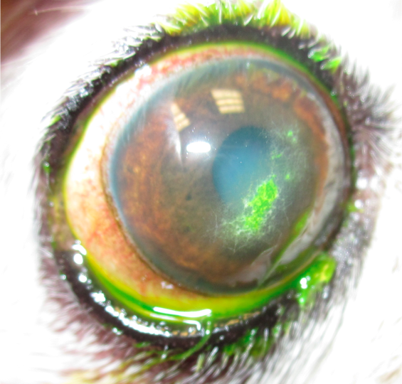

Corneal mineral degeneration is an opacification of the cornea where mineral and/or lipid is deposited and blood vessels grow abnormally toward these changes.  Many owners will first notice a “white spot” on the eye as well as ocular discomfort.

Corneal mineral degeneration can occur in one eye or in both eyes, and is often asymmetrical. It can be secondary to a traumatic injury to the cornea, pathology of the eye(keratoconjunctivitis sicca, uveitis, glaucoma, episcleritis, etc) or can also be secondary to systemic or metabolic disease processes (Cushings disease, Diabetes mellitus, hypothyroidism, hypercalcemia, etc).

Sometimes, if the mineral deposits come to the surface of the cornea, they can cause irritation/corneal ulcers. In these cases, a diamond bur keratotomy or keratectomy may be useful to hasten healing.  Topical EDTA (a calcium chelator) may help to bind, smooth and remove the painful deposit. Many of these patients could require lifelong topical eye medications, such as EDTA as well as an antibiotic, as re-ulceration can occur commonly. They are at risk of a corneal infection and potentially blindness.

**If your pet who has been diagnosed with corneal degeneration starts squinting or has other signs of ocular discomfort, please call us or your primary veterinarian at your earliest convenience.**

