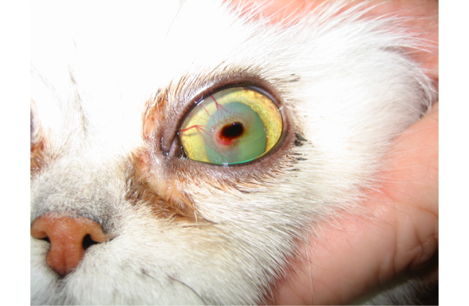

A corneal sequestrum is an area of necrotic corneal tissue that occurs in cats. This area of degenerative tissue often occurs in connection with a persistent corneal ulcer, and many of these pets have signs of feline herpesvirus flare-ups.  When a corneal sequestrum occurs, you may notice that your cat has increased tearing, squinting and redness of the affected eye. A corneal sequestrum often appears black or brown in color.  A corneal sequestrum can be seen in any breed of cat, but is typically found in Persians and Himalayans.

Treatment of a corneal sequestrum is usually surgical.  As this is a necrotic segment of the cornea, removal of the abnormal tissue will restore ocular comfort. A keratectomy procedure is performed under an operating microscope with general anesthesia. Sometimes, the amount of damaged cornea is full thickness, and a graft of new tissue is necessary to replace completely abnormal cornea (Tectonic grafting procedure). Possible complications include infection, dehiscence of the graft and intraocular inflammation. 

**If your pet starts squinting or has other signs of ocular discomfort, please call us or your primary veterinarian at your earliest convenience.**

